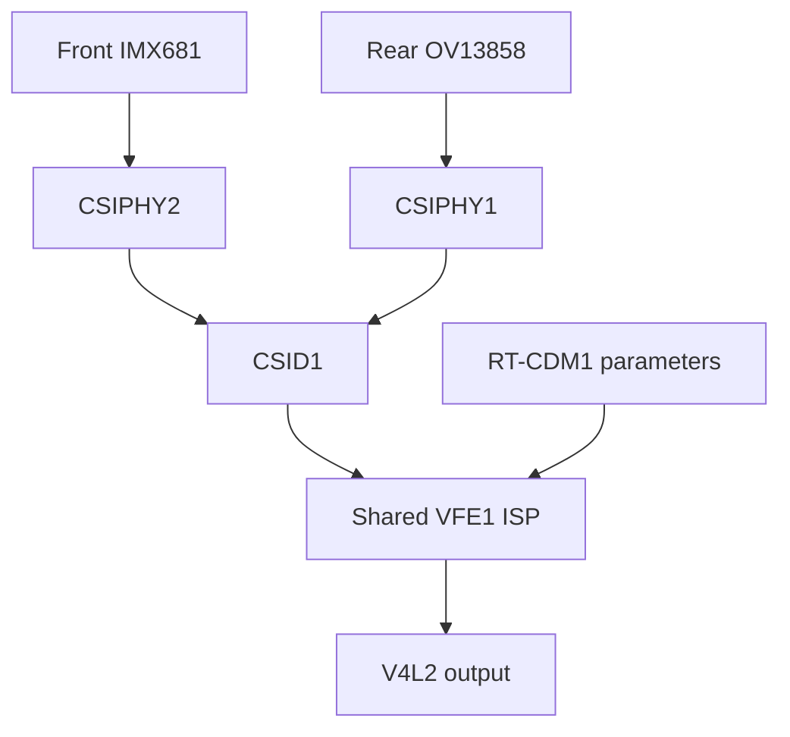

## 2026-10-07 illuminated Linux/Windows/Linux bracket complete; all control delays2

Room lights user reportedON18:26:29UTC. Linux03 source4fffdaa1/audit31/build09
and Linux04 sourcef9c77ffe/SAME modules/libcamera/tuning each pass320 native
standard cam2560x1440 NV12 frames,324 isolated IPA results,1625 owner checks/
325 retirements,328 typed defaults,19 matching known-register readbacks. All3
fields exposure1000/2000,analogue0/512,digital256/512 show six reversible
statistics+processed-Y responses at command SOF+2 in EACH independent boot.
Twelve changes/field overall now qualify empirical response delay2 for tested
tuples; no copied sensor delay or gain inference solely from write/readback.
Prior RAW01 already showed actual gain-dependent distribution response.
Auto feedback/DelayedControls runtime integration still disabled/unimplemented;
first-row SensorTimestamp,optical gain law,meter scale/zero point/AE target
remain unqualified. Do not infer application exposure timestamp from CSI IRQ.

Fresh Windows reference source3ee09e32 passes16 distinct source-timestamped
FRONT Color/VideoRecord2560x1440 NV12 samples. Ordinary automatic controls
unchanged,API reportsauto exposure/5000ticks,ISO unavailable. WinRT API setting
is NOT independent sensor-register proof. Full nominal Y range declared by
MF property GUID/value1,verified official SDK header and Microsoft enum docs.
No optical pixels/files/image hashes exported,IR/AI/effects not requested.

Actual time bracket:
- Linux-before03 capture18:32:26.820..18:32:38.589UTC.
- Windows capture18:46:28.478..18:46:39.771UTC.
- Linux-after04 capture18:55:16.955..18:55:28.675UTC.

Same sparseY sampling2560x1440,every64th horizontal pixel/allrows,57600 values/
frame,using28 final restored-baseline Linux frames each side. Median meanY
before5.088229/Windows88.255408/after4.940304. Linux baseline difference2.907%,
passes5%or measured-temporal-jitter screen. Windows/Linux output-code mean ratio
17.60086 is diagnostic,NOT optical gain/radiometry or quality ratio. Clear
captured-mode gap persists under reported room lights; cannot assign its cause
to weather/lens/driver/ISP alone. Windowsauto vs Linuxfixedmanual controls are
not matched;lux,scene identity/position and FOV/crop alignment uninstrumented.
Both declare full nominal range,but transfer/black point not photometrically
calibrated. Do NOT promote stable aggregate means to complete scene identity,
image quality parity or conclusively localized driver brightness defect.

All LinuxSTOPs clean,sensors suspended,graph neutral,critical0,Golden unchanged.
03 candidatea9acc136 returned Golden8c0c4887;Windows returned Golden5a4c829e;
04 candidate8d1a6317-5d65-4718-a061-ef8b4fc71468 returned current Golden
f4c6df65-3302-4144-8545-3fd0cf83ea58.03/04/nativeRAW01 all consumed/retired.
Native totals33 completed sensor streams,29 retired IDs,58 native candidate/
Goldenboots;failure5prestream/3poststart unchanged. Separate new Windows
reference1 stream/1 consumedID/2 Windows-and-Goldenboots (combined60 boots,
30 identities). Windows atomic task executedexactlyonce/unregistered; initial
NULL-trigger-count preparation error occurred BEFORE Start/camera and was
audited/corrected with actual XML trigger count0,not a second capture.
No candidate boot/unit/writer/FW,camera nodes/modules/process remains.
EFI order0005,0004,0000,0001,0002,0006 unchanged;Golden permanent default.

NEXT implement standard libcamera DelayedControls using measured delay2 for
FLL/exposure/analogue/digital,all four controls same normal non-priority clustered
ioctl;metadata describes queued/applied controls without SensorTimestamp. Verify
explicit bounded request controls and restart/reset at hardware before feedback.
Then resolve RAW/ISP stats optical domain/black level/normalization and bounded
AE targets using Windows reference. Do not repeat indistinguishable low-signal
gain-delay experiments; timing gate now closed for tested tuples. Rear ISP/focus,
dynamic tuning/ABI/clock policy,independent tuning,soak/switch/fault and full
Windows optical acceptance remain. No bespoke daemon/CPU image ISP/AI/OEM
executable runtime,no OS sleep. Source/derived evidence committed below:
docs/NATIVE-RGB-FRONT-CONTROL-RESPONSE-03/04-20261007.json (two files),
docs/NATIVE-RGB-WINDOWS-FRONT-LIGHT-01-20261007.json,
docs/NATIVE-RGB-FRONT-ROOM-LIGHT-BRACKET-20261007.json,
src/native-rgb/front-windows-reference/analyze-bracket.py.
Earlier NEXT is history.

## 2026-10-07 Windows front1440p reference passes; Linux-after04 next

Fresh E-NATIVE-FRONT-WINDOWS-LIGHT-01 source3ee09e32 physically delivered16
distinct timestamped FRONT Color/VideoRecord2560x1440 NV12 samples. Sparse meanY
88.067..89.561,zero fraction0,storage255 fraction~2.1..2.24%. Windows ordinary
auto exposure reportedtrue/API5000ticks; ISO unsupported,white balance API5000K.
API values are NOT independently proven sensor register settings. No AI/effects
requested,controls/driver unmodified,IR untouched,no optical files/hashes exported.
Room lights user reportedON18:26:29UTC; scene/light continuity not instrumented.
Actual capture18:46:28.478..18:46:39.771UTC,task complete18:46:40.428.
Initial task registration guard mistakenly counted null trigger list as1 and
removed unused task BEFORE Start/CONSUMED/camera access. Audited absent evidence,
re-registered no-trigger task using XML actual trigger count0,started exactlyonce.
Atomic consume at probe entry,240s return scheduled before camera,task removed.
No repeated camera capture or consumed-ID reuse. Own return timer expedited
after verified result; returned Golden with protected assets/EFI order intact.
Derived Windows report: docs/NATIVE-RGB-WINDOWS-FRONT-LIGHT-01-20261007.json.

NEXT fresh response04 SAME kernel/libcamera/tuning/manualtuples as03 afterWindows
to finish Linux bracket. Identity04 unarmed/no attempt;03 consumed/retired.
Compare SAME sparse luma sampling rather than mean vs p99 or full vs sparse.
03 all3 fields empirically delay2 remains proven;auto feedback still disabled.
Current Windows-auto vs Linux-fixedmanual brightness comparison is diagnostic,
not matched sensor gain/exposure or calibrated parity. No defect established
solely from lowY. Full-range enum1 documented by Microsoft; exact GUID attribute
association header check pending. Earlier NEXT is history.

## 2026-10-07 room-light Linux-before capture passes all three response delays2

User reports room lights ON18:26:29UTC. Fresh response03 source4fffdaa1/audit31/
build09 passes320 native standard cam2560x1440 NV12 frames at30.00155fps,324
isolated IPA results,1625 owner checks/325 retirements,328 typed defaults and
19 matching known-register readbacks. All exposure1000/2000,analogue0/512 and
digital256/512 show six repeatable up/down statistics+processed-Y responses at
command SOF+2,restored baselines and unchanged receiver/video association.
This is measured empirical response timing for the tested tuples,not copied
from another sensor or RAW completion. Auto feedback still disabled; first-row
SensorTimestamp,optical gain law and meter normalization remain unqualified.
Linux03 capture UTC18:32:26.820..18:32:38.589,at reported new illumination.
STOP clean,sensors suspended,neutral,critical0,Golden hashes unchanged.
Candidatea9acc136-3cc0-438c-a938-9a7ac1d18ca8 returned Golden
8c0c4887-a171-4c8b-a305-7aa34bbab347;03 consumed/retired.
32streams/28retiredIDs/56candidate-Goldenboots,failurecounts5prestream/3poststart
unchanged. Original pixels/hashes private; derived03 report omits image hashes.

NEXT same-SP11 Windows front reference -> fresh Linux04 bracket. New Windows
source in src/native-rgb/front-windows-reference uses atomic one-use entry marker,
240second return timer before camera,exact FRONT Color/VideoRecord2560x1440
NV12,16 sparse aggregate Y samples,reported controls/settings/time,CPU buffer
clear; no pixels/hashes exported. Camera-free synthetic numeric/WinRT layout test
PASS on SP7 native PowerShell5.1. No Windows camera attempt yet. EFI helper now
checks actual Git upstream instead of historical branch; persistent order remains.
Windows ordinary auto controls vs Linux manual are intentionally recorded.
Lights and scene/position requested unchanged,but not independently measured.
No qualified matched brightness/quality conclusion yet. Earlier NEXT is history.

## 2026-10-07 user turned room lights ON; matched comparison starting

User explicitly reports lights ON at18:26:29UTC/19:26:29BST. Asked to preserve
SP11 position and lighting across captures. No lux or camera orientation measured.
Fresh response03 will capture native standard libcamera320 NV12 frames under
new lighting BEFORE Windows,using existing qualified audit31/build09 and known
register readbacks. Identity03 is new,unarmed and has not run. Atomic consume
at entry and ARMED check added; old01/02 spent. Source changes only identity,
execution guard and recorded environment; no sensor/ISP/tuning change.
NEXT Linux03 -> same-SP11 Windows FRONT RGB reference -> fresh Linux04 bracket.
No matched condition/quality claim until both sides and continuity evidence.
Previous RAW01 physical gain distribution response proof retained; previous
exposure/FLL empirical response2 retained,gain delays/auto feedback unqualified.
Current Goldene0c99b76,31streams/27retiredIDs/54boots;failurecounts5/3 unchanged.
Earlier NEXT is history.

## 2026-10-07 native RAW gain actuation proven; optical signal/delay unresolved

E-NATIVE-RAW-CONTROL-01 source9e9e44c5/audit31 modules passes320 native front
3840x2160 packed10-bit frames at30.005318fps with ISP trials disabled. All19
known-register readbacks match coherent FLL/exposure/analogue/digital tuples,
error0;18 changes plus unchanged final restore. Read-only sparse aggregate
metrology samples31654 photosites/phase/frame,no image conversion/export.
STOP clean,sensors suspended,graph neutral,critical0,Golden hashes unchanged.
Capture UTC2026-10-07T17:53:00.473..17:53:11.395; candidate
a64b9f97-99f7-4bee-a38a-3462ac44452a returned Golden
e0c99b76-ca28-4be3-9332-86c7cdf6eecd. Identity01 consumed/retired;31 completed
sensor streams,27 retired identities,54 candidate/Golden boots;5 prestream/
3 poststart qualification failures unchanged. No boot/unit/writer/FW remains.

RAW means stay near64 with medians64,p01=62/63,p99=65..67; mean-response
qualification remains inconclusive for exposure and both gains. Physical
illumination/lens position and optical black reference are unknown; do not infer
a dark-image defect,covered lens,night or failed gain programming. Retrospective
spatial-distribution variance shows strong reversible gain response,all4 Bayer
phases and all3 cycles: analogue raised/baseline variance1.80..2.08,digital
3.76..4.05. Nine analyzer tests pass,including variance response without mean
change and drift/no-response rejection. Original runtime mean analysis preserved;
variance is a separately labelled retrospective interpretation of same capture.
Controls demonstrably affect sensor RAW. This does NOT qualify nominal optical
gain scaling,scene brightness or gain application delay. No RAW SOF reference:
timestamps are buffer completion. Previous processed exposure/FLL response delay2
remains empirical; no copied gain delay or SensorTimestamp. Auto feedback disabled.

NEXT matched same-SP11 Windows front reference bracketed by fresh Linux captures;
preserve camera/scene/position/light,record UTC/settings/exposure/gain/range and
environment changes. Rain/cloud report2026-10-07 persists; no matched Windows
reference yet. Qualify comparison only with actual condition evidence. Then
resolve ISP meter domain/black-level/scale using RAW and processed statistics;
do not repeat indistinguishable low-signal ISP/RAW gain tests. Rear ISP/focus,
dynamic tuning,production ABI/clock policy,independent tuning,soak/switch/fault
and Windows optical acceptance remain. No bespoke daemon/CPU image ISP/AI/OEM
executable runtime,no OS-level sleep. Source: src/native-rgb/front-raw-control;
evidence: docs/NATIVE-RGB-FRONT-RAW-CONTROL-01-20261007.json.
Earlier NEXT is history.

## 2026-10-07 native RAW gain isolation source ready; fresh01 unarmed

The next bounded experiment E-NATIVE-RAW-CONTROL-01 is source-built and camera-free
verified. New src/native-rgb/front-raw-control uses qualified audit31 modules with
ISP trial features disabled, front CSIPHY2/CSID1/RDI0 packed10-bit source,320frames
and18 grouped exposure/analogue/digital changes. Four Bayer-phase aggregate
measurements only,no CPU ISP or pixels exported. Six analysis tests plus exact
RAW10 unpack/bounds and synthetic full-phase sampler pass; Golden invocation
denies device access. Known-register readback19 transactions expected; final
baseline command is unchanged and need not create a twentieth CCI write.

No fresh01 hardware attempt yet. NEXT prepare/verify fresh01 assets,checkpoint
source,arm once,measure gain RAW plateaus and return/verify protected Golden.
RAW completion timestamps are not SOF; no gain application delay can be accepted
from this experiment. Optical units,matched Windows light/scene and brightness
defect remain unqualified. Current Golden8dffb0ec,30 completed streams,26 retired
IDs,52 candidate/Golden boots;5 prestream/3 poststart failures unchanged. Prior
response02 exposure delay2 and all register retention remain proven. Auto feedback
still disabled; original pixels/Windows assets private SP11,no OS sleep.
Build evidence: docs/NATIVE-RGB-RAW-CONTROL-BUILD-01-20261007.json.
Earlier NEXT is history.

## 2026-10-07 exposure response/readback hardware proven; gains still ambiguous

Fresh response02 source9c648fd8/kernel audit31/libcamera build09 passes320 standard
cam2560x1440 NV12 frames at30.00003fps,324 actual isolated IPA results,1625 owner
checks/325 retirements,18 grouped sensor ioctls and328 typed defaults. All19 reads
of known FLL/exposure/analogue/digital registers match commanded values,error0.
CCI write completion alone is no longer the only actuation evidence. Readback
confirms retained register values,not their optical pixel effect.

Exposure1000/2000 changes show six sharp,repeatable statistics and processed-Y
responses at command SOF+2,with stable restored baselines and unchanged receiver/
video source observations. Same offset seen in response01 retrospectively after
removing unsupported15%-of-absolute-luma threshold. Metering units/zero point are
unqualified; use response above measured noise,8 analyzer tests pass. Fresh02
qualifies exposure's empirical response delay2. First-row exposure timestamp is
still unproven. Analogue0/512 and digital256/512 writes/readbacks succeed but
responses remain ambiguous; no gain delay accepted,no copied delay2.

Both01/02 captured640 app frames/648 IPA results overall. All STOPs clean,error0,
sensors standby,graph neutral,no SOF after final STOP,critical0,Golden unchanged.
02 UTC capture17:29:35.803..17:29:47.897 on2026-10-07; current Golden
8dffb0ec-59fd-4ca5-8103-34b098d5cd21. Both response IDs consumed/retired; all26
candidate IDs retired,30 completed sensor streams,52 candidate/Golden boots.
Failure counters5 prestream/3 poststart qualification failures unchanged; response
capture PASS and unqualified gain timing are intentionally separate. No candidate
boot/unit/writer/FW remains. dc9ca301 GitHub sync issue is resolved.

NEXT isolate analogue/digital gain response in the already-proven native front
RAW path,using bounded baseline/raised/restored plateaus and known-register reads,
then compare hardware statistics/processed output and matched Windows same scene/
lighting/timestamps. Do not repeat the same ambiguous ISP experiment or infer a
brightness defect from low Y. Metering interpretation and physical illumination
remain unresolved. RAW work is a diagnostic,not a CPU image ISP or release path.
Automatic AE/AWB/DelayedControls still disabled/unqualified; SensorTimestamp absent.
Rear ISP/focus,dynamic tables,production ABI/clock policy,independent tuning,
soak/switch/fault and Windows optical acceptance remain. Earlier NEXT is history.
Evidence: docs/NATIVE-RGB-FRONT-CONTROL-RESPONSE-01/02-20261007.json,analysis
correction,readback audit31 and libcamera build09. Originals/pixels/logs private SP11.

## 2026-10-07 exposure/gain capture PASS; known register readback next

Fresh response01 sourcea05b9673/audit30/build09 passed320 standard cam NV12 frames
at30.00518fps,324 isolated IPA metering results,1625 owner checks/325 retirements,
18 grouped control changes/19 CCI writes and328 typed defaults. STOP clean,error0,
neutral graph,sensors standby,no SOF after STOP,critical0,Golden hashes unchanged.
Capture UTC17:20:26.585..17:20:38.251 on2026-10-07; returned Golden
6c63dcc0-8a5b-4436-a5fc-20a13740118f. response01 consumed/retired;29 completed
streams,25 retired IDs,50 candidate/Golden boots; failure counters unchanged.

Original analysis leaves all field delays unqualified. Exposure has six small,
repeatable SOF+2 statistics/pixel steps but failed an unsupported15%-of-absolute-
level threshold. Metering optical units/zero point are not established. Corrected
noise-based analysis passes8 tests including pedestal-dominated small signals;
retrospective01 exposure delay2 passes,analogue/digital remain ambiguous. The
original01 result is preserved; corrected interpretation needs fresh evidence.

Kernel audit31 W=1/-Werror adds opt-in reads of only the four known sensor control
registers after group release; does not alter writes. Fresh response02 uses same
build09/18-change/320-frame experiment,readback19 commits,noise-based response
analysis and restored-baseline screens. Readback confirms register retention,
not pixel application. Mismatch/read failure blocks timing qualification without
relabelling a healthy capture as failure. No physical02 attempt yet.

NEXT determine actual exposure response and whether gains reach the known sensor
registers,then resolve ambiguous gain response/metering using source/readback and
matched Windows conditions. Do not assume brightness fault from low Y; no matched
Windows reference. Automatic AE/AWB and DelayedControls still disabled/unqualified;
SensorTimestamp absent. Rear ISP/focus,normalization/AE targets,dynamic tables,
production ABI/clock policy,independent tuning and optical acceptance remain.
Earlier NEXT is history; originals/pixels/logs private SP11,no suspend.

## 2026-10-07 exposure/analogue/digital response built; response01 next

Pending dc9ca301 frame-length-result push has succeeded. Current Golden is
 a2506d21-9074-4cf6-87c9-b3a0f13828e1, camera idle. libcamera build09 passes
Werror9 tests/2 VIMC skips and adds explicit exposure-gain-v1 bounded development
mode. At SOF16..288,18 ordinary four-member sensor control ioctls change exposure
1000/2000,analogue0/512,digital256/512 one field at a time,three up/down cycles per
field. FLL3554 stays fixed; every second change and the final tail restore defaults.
No automatic feedback or applied-frame timestamp/control metadata enabled.

Fresh response01 uses unchanged kernel audit30 and build09 for320 standard cam
NV12 frames/actual isolated IPA pairs,19 CCI commits including setup,STOP/neutral/
standby/Golden checks. Candidate log buffer4M retains the complete diagnostic
trace; UTC capture start/end recorded. No hardware stream or boot yet.
Capture/queue success and per-field timing qualification are separate. Pure
analyzer7 tests reject absent/gradual response,baseline drift,uncorroborated output,
changed source association and malformed samples; verifies distinct field delays.
Require six sharp consistent transitions per field,processed-output corroboration,
restored-baseline screening and unchanged receiver/video source observation.
Lighting screen is statistical,not an instrumented illumination reference.
Ambiguous fields remain unqualified; do not copy FLL offset2 to exposure/gains.

Prior28 completed streams/24 retired IDs/48 candidate-Golden boots unchanged.
Data-only tuning/pixels/logs remain private SP11. No matched Windows optical
reference; low Y remains observation,no diagnosed brightness defect. Rear ISP/
focus,normalization/AE targets,dynamic tables,production ABI/clock policy,
independent tuning and soak/switch/fault/optical acceptance remain. Earlier NEXT
statements are history; no daemon/CPU image ISP/AI/OEM executable runtime.

## 2026-10-07 native grouped frame-length response hardware PASS

Fresh control-timing02 source74fef62f/kernel audit30/libcamera build08 physically
passes128 standard cam2560x1440 NV12 frames and132 actual isolated IPA results.
Six complete sensor V4L2 control-cluster writes at SOF16/32/48/64/80/96 alternate
FLL7108/3554, exposure1000/analogue0/digital256 unchanged. Initial setup plus six
successful CCI transactions are uniquely bracketed by userspace ioctls.
All six measured receiver interval responses start at command SOF+2; plateaus
15.00266/30.00534/15.00279/30.00533/15.00276/30.00541fps. CCI duration2.336-3.186ms.
Restored baseline at96 and held30fps through STOP. No brightness input is used.

128 app/statistics/IPA pairs,133 retirements,665 owner checks,136 typed defaults,
clean STOP,error0,all sensors standby,neutral graph,no SOF after final STOP,
critical kernel faults0,Golden hashes unchanged. Returned Golden
 a2506d21-9074-4cf6-87c9-b3a0f13828e1. timing01/02 consumed and retired; all24
candidate IDs retired,28 completed sensor streams,48 candidate/Golden boots.
5 prestream/3 poststart qualification failures; latest failure was01 analysis
precision, with successful capture/control writes. Its FAILED evidence remains.
No test boot/unit/writer/firmware remains. Private pixels/tuning/logs stay SP11.

01 used an incorrect individual5% period criterion on IRQ arrival observations.
Corrected acceptance uses plateau mean3%,median5% and disjoint30/15fps onset bands;
real-trace checks plus CCI-error/missing-commit/no-response negative checks pass,
and fresh02 independently confirms all six SOF+2 responses. IRQ times include
arrival jitter and are not first-row sensor exposure timestamps.

NEXT: separately measure exposure,analogue and digital control response under
stable-light screening and repeated up/down changes,with CCI completion/frame/
statistics identity. Do not copy the observed FLL offset2 to other controls or
publish applied-frame metadata. Standard DelayedControls parameters remain
unqualified,automatic AE/AWB disabled,SensorTimestamp absent. Metering units and
AE targets,dynamic tables,rear processed ISP/focus,production ABI/clock policy,
independent tuning,soak/switch/fault and matched Windows quality acceptance remain.
No diagnosed brightness defect; match physical camera/scene/position/lighting/time
and record weather/light changes. User rainy/cloudy report persists; no matched
Windows reference. Earlier NEXT statements are history.
Evidence: docs/NATIVE-RGB-FRONT-CONTROL-TIMING-02-20261007.json; failed01 and analysis
qualification are retained alongside kernel audit30/libcamera build08 reports.

## 2026-10-07 frame-length capture completed; timestamp precision corrected

Fresh control-timing01 source47176f14/audit30/build08 captured128 frames,132 IPA
results,133 ordered SOFs,665 owner matches/133 retirements,136 typed defaults.
All six normal clustered writes and seven CCI transactions succeeded; FLL returned
3554 before clean STOP,all sensors standby,critical0,Golden hashes unchanged.
Returned Golden58041c0b-5140-453a-96de-7dc00a3b9ac7. Identity01 consumed/retired.

Overall result remains FAILED: strict individual IRQ-period5% tolerance rejected
arrival jitter (baseline31.4-35.9ms). IRQ observation times are not ideal hardware
clock timestamps. Corrected analysis uses multi-period mean3%,median5% and disjoint
30/15fps interval bands20%; actual failed01 telemetry passes six offset2 transitions.
Negative CCI error/missing commit/no interval response are rejected by actual code.
This offline interpretation does not replace a fresh qualification. Evidence:
docs/NATIVE-RGB-FRONT-CONTROL-TIMING-01-20261007.json and analysis evidence JSON.

Fresh control-timing02 next uses identical audit30/build08,corrected analysis and
new identity;128 standard cam frames,exact six writes/CCI brackets,three 30/15/30
cycles,restored baseline and STOP/neutral/standby/Golden checks. No second stream
or boot yet. Counts27 completed sensor streams,23 consumed IDs,46 candidate/Golden
boots,5 prior prestream failures,3 poststart qualification failures (one is this
analysis precision failure). Exposure/gain delays and DelayedControls remain
unqualified; no brightness or Windows quality inference. Earlier NEXT is history.

## 2026-10-07 bounded grouped frame-length timing built; control-timing01 next

Kernel audit30 passes W=1/-Werror and adds opt-in read-only CCI transaction
start/end/result tracing. Source composition requires receiver SOF trial and
rejects missing dependency before creating output. No sensor register values or
CAMSS programming changed by the trace. libcamera build08 passes9 tests/2 VIMC
skips, Werror: explicit frame-length-v1 development mode performs six ordinary
four-member V4L2 control-cluster writes at SOF16/32/48/64/80/96, FLL7108/3554
three cycles, fixed exposure1000/analogue0/digital256. Restores baseline at96.
Automatic feedback remains disabled, SensorTimestamp absent, no app controls.

Fresh control-timing01 is the next one-use candidate:128 standard cam NV12
frames and matched actual isolated IPA, exactly seven CCI transactions including
initial setup, observed receiver-interval transitions and restored baseline,
clean STOP/neutral/standby/Golden hashes. Original pixels/tuning/logs remain SP11.
No physical attempt or additional stream yet; prior frame-start/restart proof
and26 streams/22 identities/44 boots unchanged. Never reuse spent candidates.

Frame-length timing uses receiver intervals, independent of scene brightness;
exposure/gain delays and metering normalization remain unmeasured. No matched
Windows reference and no diagnosed brightness defect. Apply same camera/scene/
position/lighting/time condition to optical acceptance. Rear ISP/focus and other
production/tuning/optical gates remain. Earlier NEXT statements are history.

## 2026-10-07 native receiver frame-start and restart hardware PASS

Kernel audit29/libcamera build07 physically pass both actual standard IPA paths.
Pipeline05 sourceb08bc32f:80 standard cam2560x1440 NV12 frames30.00469fps,
84 isolated IPA metering results,84 consecutive libcamera frameStart callbacks,
85 receiver IRQ SOFs,425 owner checks,88 typed defaults. Lifecycle05 source81f04f6e:
same CameraManager/Camera1/80/80 restart/reacquire passes161 app frames and173
signed threaded IPA results; app SOF counts5/84/84,IRQ counts6/85/85 reset from0
each start; final STOP has no later SOF/phase events. Stream IDs6/7/10,880 owner
checks,185 typed defaults; longer runs30.00582/30.00572fps. No module reload.

All241 app frames across these four streams matched hardware statistics/IPA.
All241 steady observations had SOF-count minus VIDEO source0. Receiver SOF IRQ
observation to VIDEO IRQ20.204-20.355ms in pipeline05; IRQ to completion2.877-
3.248ms. These observations are not first-row exposure identity or sensor-control
latency. SensorTimestamp remains absent; automatic AE/AWB remains disabled.

All STOPs clean,error0,all sensors standby after each stop,final graph neutral,
critical kernel faults0,Golden hashes unchanged. Both05 IDs consumed and retired;
all22 candidate IDs retired,26 completed sensor streams,44 candidate/Golden boots;
prior5 prestream/2 poststart failures unchanged. Latest Golden boot
33010f45-c44b-4faa-923a-953e90113de3. No candidate boot/unit/writer/FW remains.
Private original tuning, logs and optical pixels stay on SP11.
Evidence: docs/NATIVE-RGB-FRONT-FRAME-SYNC-05-20261007.json and
 docs/NATIVE-RGB-FRONT-FRAME-SYNC-LIFECYCLE-05-20261007.json.

NEXT: bounded grouped sensor exposure/analogue/digital/frame-length response and
measured per-field delays with CCI completion + receiver/frame/statistics times,
stable-light screening and repeated up/down steps. Use standard DelayedControls
only with those measurements. IMX681 already has a four-control atomic V4L2
cluster with VBLANK master; do not copy another sensor's priorityWrite=true,
which splits VBLANK into a separate ioctl. See current timing plan.
Metering normalization, AE/AWB/dynamic tables,rear ISP/focus,public ABI/clock
policy,independent tuning and soak/switch/fault/Windows optical acceptance remain.
No matched Windows reference; fixed low Y is no proven brightness defect.
Match physical camera/scene/position/lighting/time, including weather changes.
Earlier NEXT statements are history. No bespoke daemon/CPU image ISP/AI/OEM runtime.

## 2026-10-07 native receiver frame-start hardware PASS; lifecycle05 next

Fresh pipeline05 sourceb08bc32f/audit29/libcamera build07 passed80 standard cam
2560x1440 NV12 frames at30.00469fps,80 app/statistics pairs and84 actual isolated
IPA metering results. Standard CSID1 V4L2 FRAME_SYNC delivered84 consecutive
libcamera frameStart callbacks; owning ISR observed85 source-qualified bit4
SOFs at30.00535fps. All80 steady VIDEO sources had SOF-count minus source0;
latest receiver SOF observation preceded VIDEO IRQ by20.204-20.355ms and
completion followed VIDEO IRQ by2.877-3.248ms. This is interrupt phase observation,
not first-row exposure identity, sensor-control latency or SensorTimestamp proof.

425 owner checks/85 retirements,88 typed defaults,clean STOP,error0,neutral graph,
all sensors standby,critical faults0,Golden hashes unchanged. Candidate boot
 ae0cb572-f768-49c8-8cb0-0b86ba7ebba6 returned Golden54041d3b-e446-4720-844a-8c1e48300c37.
Pipeline05 consumed and retired;21 consumed identities/42 candidate-Golden boots,
23 completed sensor streams; prior5 prestream/2 poststart failures unchanged.
Evidence: docs/NATIVE-RGB-FRONT-FRAME-SYNC-05-20261007.json.

Fresh lifecycle05 is the next one-use qualification: same CameraManager/Camera
1/80/80 restart/reacquire with audit29/build07, signed threaded actual IPA, SOF
sequence reset and final-stop silence in addition to existing queue/owner/standby
checks. Its public API binary builds Werror; no stream yet. Never reuse spent IDs.
Then measure grouped sensor exposure/analogue/digital/frame-length delays before
standard DelayedControls and automatic feedback. AE/AWB, metering normalization,
rear ISP/focus, public ABI/clock policy, independent tuning and optical acceptance
remain. No matched Windows reference; fixed low Y is no proven brightness defect.
Match camera/scene/position/lighting/capture time, including rainy/cloudy changes.
Earlier NEXT statements are history. No bespoke daemon/CPU image ISP/AI/OEM runtime.

## 2026-10-07 native receiver frame-sync built; fresh pipeline05 next

Source-qualified CSID680 IPP CAMIF_SOF is bit4 (status0xac, clear0xb4);
Qualcomm GPL register source, commit38d50357, SHA9240958e, matches the pinned
SP11 Windows IPP handler bit4 test. Epoch0 bit21 remains a different event.
Source evidence: src/native-rgb/front-sof-source.json. Kernel audit29 compiles
W=1/-Werror: explicit native_front_sof_trial depends on data-only profile mode;
CSID1 accepts standard FRAME_SYNC, existing owning ISR emits ordered events,
IRQ barriers reset/start and disarm/stop. No hardware mask/DMA programming change.
Read-only phase observations relate SOF count to VIDEO interrupt count.

libcamera build07 passes Werror9 tests/2 VIMC skips; subscribes to receiver
frameStart before capture, checks continuity, unsubscribes after hardware stop.
No control scheduling or SensorTimestamp publication. Fresh pipeline05 is the
next one-use candidate, requiring80 standard cam NV12/statistics/IPA pairs and
actual SOF delivery/phase observations, STOP/neutral/standby/Golden protection.
Audit28 was an offline SOF-only build; audit29 adds phase observations. Neither
created a sensor stream or consumed hardware identity. Hardware timing remains
unproven until pipeline05. Sensor delays/metrology/AE/AWB and rear ISP remain next.
Matched Windows scene/lighting/capture-time condition still applies to quality;
low Y alone is not a brightness defect. Earlier NEXT statements are history.

## 2026-10-07 current native front IPA: both standard paths hardware-proven

Actual libcamera build06/audit27 now passes isolated standard cam80 capture and
signed threaded same-CameraManager/Camera1,80,80 restart/reacquire. Pipeline04
source90837d1d delivered80 NV12 frames30.00485fps with84 metering results,
425 owner checks and88 typed requests. Lifecycle04 source964de842 delivered161
app frames,173 metering results across fresh streams6,7,10,880 owner checks and
185 typed defaults; longer captures30.00543/29.98823fps. No module reload.
All stops clean, sensors suspended after each stop, final graph neutral,
Golden hashes unchanged, critical faults0. Returned Golden boot
b2e5554f-6b33-4aca-8e7f-ffac7b241ecf. Pipeline04/lifecycle04 consumed and retired;
all20 candidate identities retired,22 completed sensor streams,40 candidate/
Golden boots. Pixels/original tuning remain private SP11.

The actual IPA maps eight read-only shared statistics buffers, meters exact
stream/sequence/completion-time identities and produces qualified mask0 typed
defaults. Metadata buffers wait for matching IPA results before requeue; app and
startup/spare completion also requires metering. Stop barriers precede unmapping.
Build06 Werror9 tests OK/2 VIMC skips. No bespoke daemon or CPU image ISP.

NEXT concrete blocker: native frame-start events and measured sensor-control
delays before automatic exposure/gain. Source audit shows the current VFE17x SOF
handler is a no-op and VFE core ops expose no event subscription. CSID680 Epoch0
and BUF_DONE counters are not exposure/SOF proof. Qualify an actual receiver SOF
source, standard V4L2_EVENT_FRAME_SYNC sequence/association and grouped sensor
change effects; use libcamera DelayedControls only with measured delays. See
docs/NATIVE-RGB-FRONT-CONTROL-TIMING-PLAN-20261007.md. Meter normalization, AWB and
dynamic ISP tables still require qualification. SensorTimestamp remains absent.

Fixed settings/low Y do not establish a brightness defect; matched Windows same
physical camera/scene/position/lighting and time-proximate captures required.
Rear processed ISP/focus, public ABI/clock policy, independent tuning and long-run/
switch/fault/Windows optical acceptance block product completion. Actual IPA is
no longer absent. Earlier NEXT statements are history. Evidence:
docs/NATIVE-RGB-FRONT-IPA-04-20261007.json and
docs/NATIVE-RGB-FRONT-IPA-LIFECYCLE-04-20261007.json.

## 2026-10-07 actual native front IPA physically verified

Fresh pipeline04 used90837d1d/audit27/libcamera build06. Standard cam delivered
80 hardware2560x1440 NV12 frames at30.00485fps through a real isolated libcamera
IPA. Eight shared statistics buffers produced84 ordered metering results;
all80 app frames matched stream/sequence/completion time. The IPA produced88
typed mask0 defaults. Kernel passed425 owner checks/85 retirements; cam exit0,
STOP clean, graph neutral, all sensors standby, critical faults0, Golden hashes
unchanged. Returned boot2aa4c3a8-f6c6-4d6a-b805-b8c0586b7f48. Pipeline04 consumed
and retired; all older candidate identities remain retired.

Actual IPA is now hardware-proven. Automatic AE/AWB feedback, sensor control
delays, first-row exposure timestamp and optical metering normalization remain
unqualified. Fixed settings and low Y do not establish a brightness defect;
matched Windows camera/scene/lighting/capture-time comparison remains required.
Next lifetime gate uses fresh lifecycle04 with the same actual IPA in its signed
standard threaded path:1/80/80 restart/reacquire, stop barriers/shared maps and
fresh stream identities. Then qualify sensor timing and control feedback.
Rear ISP/focus, dynamic tables, public ABI/clock policy, independent tuning and
long-run/switch/fault/Windows optical acceptance still block product completion.
See docs/NATIVE-RGB-FRONT-IPA-04-20261007.json; earlier NEXT statements are history.

## 2026-10-07 actual native front IPA built; pipeline04 next physical gate

The front pipeline now requires a standard libcamera IPA and generated proxy.
The IPA maps eight read-only statistics buffers, meters exact stream/sequence/
completion-time identities and produces qualified mask0 typed default parameters.
Metadata buffers remain held until matching IPA results; app and startup/spare
buffers retire only with video, statistics and metering together. Stop barriers
precede unmapping. Fixed exposure/gains only; no automatic feedback yet.

Pinned libcamera build06 passes Werror with9 tests OK and2 VIMC-dependent skips.
New actual-implementation memfd tests cover mapping admission, parameter order,
nonzero AEC reduction, stale/duplicate/malformed rejection and restart reset.
Build05 failed offline on a staging newline escape; no hardware attempt occurred.
Fresh pipeline04 is the next one-use hardware identity, using audit27/build06,
requiring actual isolated standard IPA,80 app frames and ordered metering,
STOP/neutral/standby and protected Golden return. Never reuse consumed IDs.

NEXT after physical IPA qualification: qualify sensor/application control delays
and metering domain before AE/AWB feedback. Brightness attribution still requires
matched Windows camera/scene/lighting/time; low Y alone is not a defect proof.
Rear processed ISP/focus, dynamic tables, public ABI/clock policy, independent
tuning and long-run/switch/fault/Windows optical acceptance remain incomplete.
Earlier statements that actual IPA is absent describe historical builds.

## 2026-10-07 user requirement: compare brightness under real conditions

Low measured Y is an observation, not an established Linux brightness defect.
Compare with Windows on the same physical camera, scene, position and lighting,
as close in time as dual boot permits. Record capture timestamps, time separation,
resolution/frame rate, automatic/manual settings, available exposure/gain and
output colour/range interpretation. Changes in daylight, weather or lighting
between captures confound brightness attribution; use stable lighting or repeat
the pair. The user reports rainy/cloudy conditions today; do not assume daylight
brightness or compare a night capture with an unrelated daytime Windows image.
Current captures have no matched Windows brightness reference, so their optical
cause remains undetermined. This requirement applies to front and rear acceptance.

## 2026-10-07 current native front pipeline: real app and truthful metadata

Latest pipeline03 usedacd82c36/audit27/libcamera build04. Standard cam captured
80 hardware2560x1440 NV12 frames at29.9919fps with80 statistics/request pairs,
425 owner matches across85 retirements,88 typed requests and one kernel data-only
profile load. cam exited0, explicit STOP clean, graph neutral, all sensors standby,
Golden hashes unchanged; returned boot8590cbc2-9808-4f9a-ac64-53e9ece6d5f7.
Pipeline01/02/03 and lifecycle01/02/03 are consumed/retired; never rearm.

Removed the incorrect SensorTimestamp metadata publication: kernel completion
ktime_get_ns is not first-row exposure/CLOCK_BOOTTIME. Physical pipeline03 verifies
that the control is absent while frame/statistics completion-time pairing works.
Build04 passes Werror with8 tests and2 VIMC-dependent skips.
Lifecycle03 already passed same CameraManager/Camera1,80,80 restart/reacquire with
build03/audit27,880 owner checks and185 typed requests; all sensors suspended after
each STOP. Its test asserted the old timestamp association, not exposure semantics.
Before reusing that test with build04, update it to use FrameMetadata and assert
absence of unqualified SensorTimestamp; use fresh candidate/assets identity.

NEXT: implement actual libcamera IPA/automatic controls. Use source-qualified AEC/
AWB statistics and sensor gain/exposure helpers, establish control delays and real
SOF/exposure timing, and associate sensor/typed-ISP changes with hardware frames.
Validate metering domain against measured NV12 and matched Windows conditions and controlled gain response
before enabling feedback. Do not infer optical quality or tuning correctness from
valid queue buffers or pair timestamps. No daemon, CPU pixel ISP, AI or OEM code.
Rear ISP/focus, dynamic tables, production ABI/clock policy, independent tuning,
long soak/switch/fault tests and controlled Windows optical acceptance remain.
Product incomplete; low measured Y has no established optical cause. See
docs/NATIVE-RGB-FRONT-PIPELINE-03-20261007.json and lifecycle03 evidence.
Earlier NEXT is history.

## 2026-10-07 front libcamera restart and reacquire physically verified

Fresh lifecycle03 usedd1548a01/audit27/libcamera build03. The same CameraManager
and Camera captured1 frame, restarted for80 frames using the same configuration
and buffers, then released/reacquired/reconfigured for80 more. All161 app requests
paired correctly with statistics and fresh stream IDs6,7,10. Longer runs held
30.005fps. Three explicit STOPs retired6,85,85 frames; all880 owner checks passed,
185 typed requests admitted,3 kernel profile loads, zero critical faults.
All3 sensors suspended after each STOP, final graph neutral, Golden unchanged;
returned bootcbf80aa9-4cda-4c9e-a33a-432d4261f080.

Lifecycle01 exposed cached-profile/closed-FIFO restart rejection. Successful
STREAMOFF now clears stream-owned profile/FIFO after worker exit, preserving
unsafe/pinned early returns. Lifecycle02 exposed the original static one-start
NV12 guard. Profile mode now requires an inactive, unpinned worker and still
checks every WM disabled and linear MODE state before hardware programming.
Original diagnostic modes retain their one-start guard. All3 lifecycle identities
are consumed and retired; never rearm. No module reload occurred between rounds.

NEXT: real libcamera IPA/automatic controls with qualified sensor delays.
Timestamp audit also found that current SensorTimestamp reports buffer-return
ktime_get_ns, not qualified first-row exposure time/CLOCK_BOOTTIME; remove that
mislabel until sensor timing is established. Pairing tests prove association only.
Fixed manual output remains dark; no optical parity. Dynamic tables, rear ISP/
focus, long soak/switch/fault recovery, production ABI/clock policy and independent
tuning remain. Product incomplete. See docs/NATIVE-RGB-FRONT-LIFECYCLE-03-20261007.json.
Earlier NEXT is history.

## 2026-10-07 standard libcamera front capture physically verified

Fresh pipeline02 used0bfda1e3/audit24 and libcamera build03: standard cam captured
80 hardware2560x1440 NV12 application frames at30.0056fps. All80 requests matched
stream, sequence and statistics timestamps. Four startup frames and tail spare
outputs stayed internal. Kernel retired85 frames with425 consumed-owner matches,
zero rejects or critical faults;88 bounded typed requests accepted, one data-only
firmware load, raw command control absent. cam exited0, explicit STOP completed,
release neutralized the graph and suspended all sensors. Golden hashes unchanged;
returned bootf4fcd6c9-dcd2-421f-a7e5-6d4525d5d30b.

Pipeline01 delivered79 frames before finite-capture tail starvation. The precise
fix reuses only fully paired/retired internal startup buffers below queue depth2.
Both pipeline identities are consumed and retired; never rearm. Original logs,
pixels and tuning stay private on SP11. No daemon, CPU pixel ISP or OEM code runs.

This proves real libcamera application/pipeline integration with fixed manual
settings, not IPA/automatic3A, rear processed capture or Windows optical parity.
Y means3.423–3.429/max11 remain dark. NEXT: lifecycle reopen/repeat and actual
standard IPA/automatic controls with qualified sensor delays; dynamic semantic
tables, rear ISP/focus, production ABI/clock policy, independent tuning and
controlled Windows optical acceptance remain required. Product incomplete.
See docs/NATIVE-RGB-FRONT-PIPELINE-02-20261007.json. Earlier NEXT is history.

## 2026-10-07 front raw-startup interface replaced and physically verified

Fresh profile01 used63be0add/audit24:80 paired NV12/statistics frames at30.000fps.
The raw command control was absent. Four malformed typed packets rejected;
missing firmware returned ENOENT and corrupted data returned EKEYREJECTED before
STREAMON. Restoring the validated data-only profile admitted84 typed requests.
A2x Bayer gain changed Y3.8084 ->7.8374 ->3.8113. All405 consumed-owner checks
passed across81 retirements with zero rejects or critical faults. Both queues
stopped, graph neutral, sensors suspended, Golden assets unchanged. Returned boot
1b29482f-1b45-4f0d-934b-74845f0eb30b. Profile01 is consumed and retired; never rearm.

The kernel uses Linux request_firmware_direct for a fixed board/mode data-only
tuning file. GPL source owns334 instruction shapes, every register location,
DMI/device binding and the internal provider carrier. Firmware carries only
2661 scalar words and26036 table bytes, with an exact qualification SHA256.
The materializer reconstructs the qualified startup exactly and269 corruptions
reject before output mutation under ASan/UBSan. Original tuning remains private
on SP11; independently redistributable tuning is not established. No OEM code runs.

NEXT: actual libcamera pipeline/request/statistics/IPA integration, then automatic
controls, full semantic tables, rear processed capture, reopen/soak/switch and
Windows optical acceptance. Front startup no longer requires a userspace raw
command packet. This fixed-mode qualification does not prove automatic3A or
final public ABI/clock policy, tuning distribution, rear ISP or optical parity.
See docs/NATIVE-RGB-FRONT-PROFILE-01-20261007.json. Earlier NEXT is history.

## 2026-10-07 typed front ISP scalars physically verified

Fresh params01 used64a4c840/audit23:80 paired NV12/statistics frames at30.006fps,
84 typed requests5..88 and5 malformed/forbidden-input cases passed. The kernel
packs scalar values and owns all16 bank selectors, command/DMA addresses and CDM
framing. Per-frame raw capsules are rejected. A2x Bayer gain changed measured Y
from3.4580 to7.1463, then reset to3.4560.
405 consumed-owner checks passed across81 retirements; zero rejects or critical
faults. Both queues stopped, sensors suspended, graph neutral, Golden unchanged.
Returned boot714c4187-aa54-403f-bda7-ceeab8cba8fb. Params01 is consumed and retired;
never rearm. Original profile, statistics, logs and pixels remain private on SP11.

The shared pointer-free64-byte QXP1 schema passes1979 sanitizer checks and
92 private fixture comparisons. Its real libcamera libipa encoder builds under
Werror with8 tests passing and2 VIMC skips. This is scalar control qualification,
not automatic3A, dynamic table support or the final public request ABI. A private
R4 bootstrap profile still supplies startup defaults; product incomplete.

NEXT: remove the diagnostic bootstrap dependency and connect actual libcamera
requests/pipeline/IPA automatic controls, then rear processed capture, reopen,
soak/switch and controlled Windows optical acceptance. Implement source-qualified
semantic startup/tuning; do not promote a raw-command interface or a helper-only
build to a product. See docs/NATIVE-RGB-FRONT-PARAMS-01-20261007.json.
Earlier NEXT entries are history.

## 2026-10-07 frame-associated front statistics physically verified

Fresh metadata02 used c4430c42/audit21:80 video/metadata pairs at30.006fps.
Every pair matched sequence, timestamp, stream identity and exact payload sizes;
all80 AEC_BE bundles passed the source-qualified luma reduction (0.756–0.760).
405 consumed-owner checks passed across81 kernel retirements, with zero rejects,
gaps or critical faults. Both queues stopped; graph neutral, all sensors suspended,
Golden assets unchanged. Returned boot53ecc444-d0be-491d-9929-df1ce6738a1f.

Metadata01 safely rejected startup because the old runner looked only at the first
VFE source-pad remote. Adding the statistics sink exposed that assumption.
Metadata02 uses an exact pixel-link lookup, preserving upstream route gates.
Both metadata identities are consumed and retired; never rearm. See
docs/NATIVE-RGB-FRONT-META-02-20261007.json and the recorded metadata01 failure.

The metadata node uses standard V4L2 META_CAPTURE/vb2. It copies owned AEC_BE,
BHist, AWB_BG and TL_BG snapshots after every consumed-owner group retires,
before completing the corresponding video buffer. Missing queued metadata is
marked as discontinuity; the development consumer rejects it. Stream IDs reset at
STREAMON. The exact shared envelope consumer is built in real libcamera libipa,
with8 tests passing and2 VIMC-dependent skips; complete pipeline/IPA still absent.

NEXT: typed kernel ISP parameters, then complete libcamera requests/IPA automatic
controls, rear processed capture, reopen/soak/switch and controlled Windows optical
acceptance. Raw-command capsules remain diagnostic; Ymeans3.68–3.94/max11 remain
very dark. No live3A, optical parity or complete product claim. Earlier NEXT is history.

## 2026-10-07 continuous front NV12 queue physically verified

Fresh queue01 used 87d52765/audit17: 80 sequential hardware NV12 frames at
29.989 fps using four reusable vb2 buffers. Reversing the first returned pair
changed delivered indices to 0,1,2,3,1,0, proving queue-order admission.
The worker retired 81 frames with 405 matching consumed-address/session/sequence
checks across all five completion groups; zero rejects or critical kernel faults.
Explicit STREAMOFF stopped the worker cleanly. All sensors suspended, graph
neutral, Golden hashes unchanged; returned boot 7bf45528-f40f-4b3a-bb97-8f049c361ab5.
Queue01, owner01/02, NV12-01/02 and timing01/02/03 are consumed and retired;
never rearm. Original private fixtures and logs remain on SP11.

The new loop replaces numbered frame orchestration only in the isolated optional
NV12 path. It preserves Epoch0 serialization, all CDM BL_DONE receipts,
per-group ownership checks and stop-before-free. Fixed manual IQ uses all
16 source-qualified alternating DMI bank selectors; this is not live 3A.
Y means remain 3.40–3.65/max11. No optical parity, long soak or reopen claim.

NEXT: typed kernel ISP parameters and frame-associated metadata statistics,
then complete the libcamera pipeline/IPA, rear ISP and controlled optical
acceptance. The raw capsule remains a diagnostic interface, not a product API.
See docs/NATIVE-RGB-FRONT-QUEUE-01-20261007.json. Earlier conflicting NEXT is history.

## 2026-10-07 front consumed-address ownership physically verified

Fresh owner02 used9b5662a0/audit16: four native2560x1440 NV12 frames,
twenty address/session/sequence checks across VIDEO/AEC-BHist/TLBG/AWB/RS,
zero rejected owners, STREAMOFF, neutral graph and all sensors suspended.
Golden hashes unchanged; returned bootf7d6fb1b-ae4d-43b4-ad73-d74195fb0d15.
Owner01 stopped safely on an incorrect sampler RS mapping (WM16); corrected
code derives WM18 through the admitted BUS order. Both owner identities are
consumed and retired; never rearm. See NATIVE-RGB-FRONT-OWNER-02-20261007.json.
Continuous front queue remains NEXT. CDM FIFO commits already wait for BL_DONE;
preserve that receipt before reusing command/DMI memory, and every per-group
consumed-address/session check before reusing a slot. No continuous/IQ parity
claim from this four-frame proof. Earlier architecture/privacy/Golden rules apply.

## 2026-10-07 native front NV12 hardware checkpoint — authoritative current state

Fresh NV12-02 used source 0d57e1f5 and audit12 W=1/-Werror modules.
Four hardware ISP NV12 frames passed: 2560x1440, stride2560, 5529600 bytes,
sequence0..3, both planes written, STREAMOFF verified. All sensors suspended,
graph neutral, zero critical kernel faults, protected Golden hashes unchanged.
Golden returned at boot0078655c-99e9-4d37-9535-bdb3db948e36. NV12-01/02 and
timing-01/02/03 are consumed and retired; never rearm. Pixels remain private.

NV12-01 found a pre-ISP clock-policy rejection. The truthful front720MHz array
timing clock plus generic PIX margin exceeds admitted727MHz. Diagnostic02
uses the existing maximum resource vote only for this exact front mode;
actual727000048Hz verified. This is not the final continuous-load policy.
Frames are very dark (Ymean3.05–3.26,max10). No optical quality claim.

Architecture: native sensors/CAMSS + Qualcomm hardware ISP + standard
libcamera pipeline/IPA. No bespoke product daemon, software pixel ISP,
loopback, AI/effects or Windows binary dependency. Front/rear RAW and timing
ABI pass; libcamera helpers build/test (8 pass,2 VIMC skips). Product incomplete.

NEXT: replace the numbered 27-frame runner with a real queue worker and
validated per-request ISP parameters/statistics. Preserve consumed-IOVA,
owner generation, all completion groups, serialized Epoch0 updates and
stop-before-free. Do not add frame28 as another named capsule/result field.
Prove queue reuse/stop on a fresh identity, then connect libcamera requests/IPA;
rear ISP and controlled-scene Windows quality acceptance remain mandatory.
See docs/NATIVE-RGB-NV12-02-20261007.json and
docs/NATIVE-RGB-DELIVERY-20261007.md. Older conflicting NEXT entries are history.

## 2026-10-07 measured sensor ABI and source-built rear RAW verified

Identity 03 used checkpoint eca98741 and audit07 W=1/-Werror modules. Live
read-only HBLANK=2912, PIXEL_RATE=720000000 and LINK_FREQ=1200000000 verified.
240 sequential front RAW frames and 120 rear RAW frames passed three STREAMOFF
checks; all sensors suspended, graph neutral, zero derived critical fault/IR
stream markers, protected Golden hashes unchanged. Golden returned at boot
d526eb88-f17c-4e02-b66e-53d4f73f4650. Identities 01/02/03 are consumed, never rearm.
The earlier source-built rear probe failure was a stale ACPI source import;
the corrected SP11 regulator/reset/runtime-PM source now binds and streams.

Current architecture is native sensors/CAMSS + hardware ISP + standard
libcamera pipeline/IPA, no bespoke daemon, loopback, CPU software pixel ISP or
AI/effects. Libcamera helpers build/test (8 pass, 2 VIMC skips); no complete
CAMSS pipeline runtime yet. RAW success is not NV12 or optical quality proof.
NEXT: source-backed format-specific FULL bus/DMA and 8-bit ISP configuration,
then native NV12 hardware capture, continuous ownership, parameters/statistics,
CAMSS pipeline/IPA and optical/reopen/switch acceptance. No system suspend tests.
See docs/NATIVE-RGB-TIMING-03-20261007.json and engineering audit.
Older NEXT statements below are historical when they conflict with this entry.

> Source correction: the earlier native build copied a stale ACPI-assuming rear
> snapshot. A real pre-stream test exposed the mistake. The builder now uses the
> SP11 board-powered source. Read NATIVE-RGB-SOURCE-CORRECTION-20261007.md.

> Architecture update: the user accepted hardware ISP + native drivers + standard
> libcamera pipeline/IPA on 2026-10-07. The literal kernel-only boundary discussed
> below is now superseded. Hardware and quality gaps remain unchanged.

# SP11 native RGB engineering audit — 2026-10-07

## Decision and product contract

The current user instruction supersedes the October 6 software-service pivot:
deliver Linux drivers for front IMX681 and rear OV13858, using the real ISP and
standard media-controller/V4L2 interfaces, with correctly labelled processed
frames and Windows-comparable baseline image quality. Custom RGB daemons,
loopback devices, CPU Bayer conversion, AI/effects and Windows binary execution
are not release dependencies. Development tools are distinct from product
runtime. Protected IR/Hello is outside this RGB workstream.

The project has valuable hardware and algorithm evidence, but it has not yet
produced this product. Front native ISP capture is bounded; rear ISP startup is
source-only; ordinary native NV12 and continuous capture remain unproved.

The user subsequently accepted standard libcamera for host-side automatic
exposure, white balance and focus policy. Kernel drivers control hardware and
exchange parameters/statistics. Qualcomm hardware ISP processes pixels. The
architecture boundary is resolved; hardware output and pipeline integration are
still open. Read NATIVE-RGB-LIBCAMERA-20261007.md for the compiled integration.

Primary architecture references:
- https://docs.libcamera.org/master/libcamera_architecture.html
- https://cdn.kernel.org/doc/html/latest/driver-api/media/v4l2-isp.html

## Hardware and work topology

This shows selected RGB routes and shared resources, not simultaneous-stream
support. VFE1 ownership, request generations, command DMA and image/statistics
DMA must be managed as one lifecycle. Current native processed output is QC10C;
the ordinary linear-output path is a candidate.

| Location | Role and present state |
| --- | --- |
| SP11 Linux | Primary ARM64 build and camera target; Golden FullIO v19c, kernel 7.1.5-sp11-render-parity-v4+ |
| SP11 Windows | Same-machine camera quality/behavior oracle; offline during this audit |
| SP7 Windows | External KD, SSH and recovery companion; online, idle during audit |
| PiMaster | Requested control plane, persistent jobs and curated handoff |
| SP11X1ECamera-driver | Current native worktree; work/native-rgb-driver-20261007 |
| SP11X1ECamera-clean | Preserved latest experiment history, df0f26bc; experiment/e004-front-ir-vd55g0 |
| SP11X1ECamera-native | Preserved E012K scalar work, 923e23af; work/e012k-native-rear-compose |
| SP11X1ECamera / SP11X1ECamera-active | Older September 29 workspaces; preserve their evidence, do not resume by accident |
| 02-kernel | Prepared kernel source/headers and isolated candidate builds |
| Private SP11 evidence | Original binaries/tuning, retained traces and optical captures; remain local and uncommitted |

Current native checkout:
`/home/geoca/Documents/SP11-PROJECT/06-camera/SP11X1ECamera-driver`.
It preserves df0f26bc plus the E012K cherry-pick; it does not replace historical
checkouts.

Tools already available include native GCC/Clang/Kbuild, Git/gh, V4L2/media tools,
GStreamer/libcamera, Ghidra, Unicorn/Capstone and external KD. Tool shortages are
not the principal blocker. Use emulation or Windows tracing only to answer a
named missing register/algorithm/behavior question that advances a driver gate.

## Evidence and integration matrix

| Piece | Strongest retained evidence | Remaining engineering work |
| --- | --- | --- |
| RAW sensor transport | E002/E003 and subsequent optical runs; front 3840x2160 RGGB RAW10, rear 4076x2806 GRBG RAW10 | Maintain ordinary source-built sensor and board support |
| Native front VFE1 PIX | E003i-Z/HY and E004JC; bounded real QC10C frames, stats and stop | Replace manually expanded 27-frame runner and host-IQ/bootstrap dependence with repeatable queue-driven streaming |
| Native rear commands | E006G–E008O register/DMI producers and four-packet contract | Compose four complete packet-isolated semantic objects and connect the controlled startup path |
| Neutral scalar producer | E011X; E012K differential result, 26/26 present register instances | E012K uses float/libm: reference code, not kernel-ready arithmetic |
| Rear startup LSC/GTM | E011Y/Z clean replay and binder | Binder now compiled against actual kernel structures; caller still must supply all coherent nonadaptive states |
| Rear DMA lifecycle | E007Z, E008A–N and E011I | Same-generation hardware completion, stop, ownership serialization and release remain physically unproved |
| Ordinary processed format | Existing E004IK–IP NV12 negotiation, layout, WM and mapped-span planners | No measured native linear NV12 frame; explicit UBWC transition still unresolved |
| Software RGB fallback | E004LA/MA; E012E/F/J real front1080/rear4K frames | Does not meet current native-driver product contract |
| Baseline optical IQ | E012J mean Y 57.36 versus Windows 56.99 | Black, colour, shading, tone, detail and automatic controls remain open; mean brightness alone is insufficient |
| Repeated application use | Bounded software switching/reopen | Native repeated STREAMON/OFF, queue reuse, errors, cross-camera ownership and endurance |

## Why work became circular

1. Product direction alternated between full OEM/Hello reproduction, native RGB
   ISP, and a userspace software-camera product.
2. Thousands of narrow emulator/metadata frontiers accumulated without advancing
   a callable processed-camera driver. Those results are dependencies, not
   release milestones.
3. Many source contracts intentionally deny runtime with EOPNOTSUPP. Compilation
   was sometimes described too close to hardware readiness.
4. Handoffs and readiness documents lagged Git and pointed at retired work.
5. Historical builders required old paths, exact old HEADs and consumed output
   directories. Useful later fixes remained disconnected.
6. Completion requirements drifted toward demanding a separate VFE IRQ and
   pre-ACK observation without checking the published VFE680 architecture.
7. No finished ordinary-output and continuous-lifecycle strategy accompanied
   the compressed front-frame proof.

## Corrections from Qualcomm's published source

Inspected public Qualcomm camera-driver revision:
`82ac3a671a5b0a4e3b3ac4519208af1d37a93eb6`.

VFE680 explicitly advertises `CAM_VFE_HW_IRQ_CAP_EXT_CSID`, not a local
BUF_DONE controller. BUS-v3 accepts an externally supplied completion controller.
Its output top half consumes the group mask and reads the Y WM consumed address.
The generic IRQ controller reads and clears status before dispatching the
top-half callbacks. Therefore a separate VFE completion interrupt, an atomic
ten-register snapshot, or a universally pre-ACK sample is not itself a
source-supported prerequisite. E008I is not invalid merely because it samples
after the CSID clear. This corrects older hypotheses; it does not establish
SP11 runtime safety.

The actual requirement is trustworthy CSID-delivered completion correlated with
the correct consumed IOVA, owner epoch and request/buffer generation, with queue
updates serialized and each active image/statistics WM accounted for. Prove
shutdown independently before unmapping/freeing or changing shared ownership.

VFE680 also advertises no reset capability; Qualcomm TOP-v4 explicitly says
reset is unsupported. The native no-op global-reset hook is therefore not
automatically a defect. Do not turn an IRQ global-clear register into an
invented reset operation.

Published BUS-v3 supports FULL NV12 with two WMs, chroma half-height,
PLAIN_8_LSB_MSB_10 packer value 3, aligned stride, line-mode enable and UBWC off.
E004IK–IP already retained this plan. Reuse it. The missing proof is the stopped,
correctly configured compression state and actual SP11 output. Changing packer
or format alone does not clear compression. Never relabel QC10C as NV12.

Relevant public files:
- camera/drivers/cam_isp/isp_hw_mgr/isp_hw/vfe_hw/vfe17x/cam_vfe680.h
- camera/drivers/cam_isp/isp_hw_mgr/isp_hw/vfe_hw/vfe_bus/cam_vfe_bus_ver3.c
- camera/drivers/cam_isp/isp_hw_mgr/isp_hw/vfe_hw/vfe_top/cam_vfe_top_ver4.c
- camera/drivers/cam_isp/isp_hw_mgr/hw_utils/irq_controller/cam_irq_controller.c

BUS-v3 source SHA256:
`dbe53691b46f912d59a5848a7c3e039601088430fd2e3efc992d9100dcc36b44`.

## Work completed in this audit

Added `src/native-rgb/build.py`, a hash-checked, fresh-output kernel-only build.
It stages maintained front CAMSS and IMX681, rebuilds OV13858 from source, reuses
E004IK–IP, and integrates 52 source-origin-pinned rear fragments. It incorporates
E011I's source-only reclaim candidate and compiles E011Z's adaptive binder
against the real E008O types/validator rather than only mocked standalone types.
The retained E008T BF composer referenced nonexistent driver packet/bootstrap
types from its simplified test harness. The integration patch now uses canonical
E008O packet/set types and validates all four request/phase identities before
mutating any BF state. BF ROI adjustment/final parity still remains open.
Rear/NV12 runtime gates remain denied. No daemon is built or installed.

Source composition is deterministic across independent fresh staging directories.
Input digest drift, an out-of-checkout source and reuse of an existing output
are rejected. Three focused composition tests passed. ARM64 Kbuild with W=1
built qcom-camss.ko, imx681.ko and ov13858.ko with zero warnings/errors and the
current Golden vermagic. Module bytes can vary with absolute debug/build paths;
this is source reproducibility, not a claim of byte-identical module builds.

Build evidence:
`/home/geoca/Documents/SP11-PROJECT/02-kernel/native-rgb-20261007-audit-04`.
No installation, camera start or reboot occurred. Golden boot ID remained
`b6fde40d-0a84-4b48-83a1-bec435661a37`; saved default remained
`sp11-audio-fullio-v19c`; next_entry remained empty; RGB service remained inactive.

## Precise rear composition gaps

Do not restart the E008P audit from its old list of unknown origins. Later
experiments already closed several of them:

| State family | Reuse now | Missing executable integration |
| --- | --- | --- |
| Geometry, period and disabled small-IQ | E006P–T, E007W and fixed non-HFR phase policy | Populate each canonical packet from the selected Linux mode |
| RS/BHist/Tintless/AEC/AWB statistics | E009G/H, E010U/Z, E011A–G and E011M–R | Build packet-specific semantic state from established defaults/geometry; producer tracing is not the same as a Linux composer |
| BF/AF bootstrap | E008Q–T, E011S–W; canonical E008T adapter now compiles | Source-implemented ROI validation/adjustment and final DMI consistency; preserve packet0/normal distinction |
| Neutral Demux/PDPC/WB | E011X and E012K, 26/26 differential instances | Kernel-safe arithmetic/input representation and per-phase state binding; float/libm reference cannot run in kernel |
| BPC/ABF registers | E007A packer and retained clean stable DMI | Explicit calculated register-state producer and bounded initial inputs |
| LSC/GTM | E007H/P/Q and E011Y/Z | Kernel-suitable producer/input delivery and full nonadaptive base before sealing |
| Four-packet handoff | E008O materializes independent packet objects | E008K/N old materialize-all path still takes one register/DMI object; consume the four prepared command objects without rematerializing one shared state |
| Ownership and DMA reclaim | E007Z, E008A–N, E011I | Serialized runtime entry plus physical consumed-address/generation and shutdown proof |

The latest RS preset origin is E011M, not the open E011H frontier. AEC/AWB/BF
handoffs also have later source/live closure. Additional Windows tracing is
justified only for a precise remaining input or hardware uncertainty; it is not
required merely to reproduce optional OEM metadata or names. Linux may choose
its own validated policy instead of reproducing every OEM internal abstraction.

## Dependency-ordered delivery gates

| Gate | Concrete acceptance and purpose |
| --- | --- |
| 1. Source composition | Completed kernel-only build, origin manifest and real-structure integration checks; no runtime claim |
| 2. Front ordinary output | Review stopped-state/UBWC transition, then a fresh bounded front2560x1440 linear NV12 candidate; inspect private optical content, geometry and plane layout |
| 3. Rear clean bootstrap | Complete four request/phase-isolated semantic objects; name each missing producer. No optional metadata names, AI/effects or full OEM initialization prerequisite |
| 4. Rear lifetime | Validate CSID completion masks plus consumed-address/generation correlation, serialized owner/queue changes and complete shutdown; no release based on status snapshots alone |
| 5. Rear processed frame | First safely stopped real hardware-processed rear frame; then correctly labelled linear4K output |
| 6. Continuous native streaming | Shared queue-driven VB2 lifecycle, repeated start/stop, starvation, errors and front/rear arbitration; remove unrolled bounded-runner release dependency |
| 7. Baseline IQ | Measured black reference, WB/colour, shading, tone, demosaic/detail and necessary denoise; settle host-policy architecture before automatic exposure/WB/focus |
| 8. Release evidence | Matched optical targets on both OSes, controls, frame rate/latency, sustained capture, switching and crash/stop recovery |

Every new experiment must state which gate it advances and what observation
will close it. A source build, emulator counter, matching register tuple or
matching mean luminance cannot substitute for optical/lifecycle acceptance.

## Persistent constraints

Preserve Golden payloads and permanent default. Use fresh one-shot candidate
identities and record retirement. No Linux suspend/hibernate tests. Private OEM
binaries/tuning and optical pixels remain on SP11. No trust/signature bypass.
No raw captured register replay as production policy. No custom userspace
camera-runtime dependency without resolving the user's explicit requirement.
