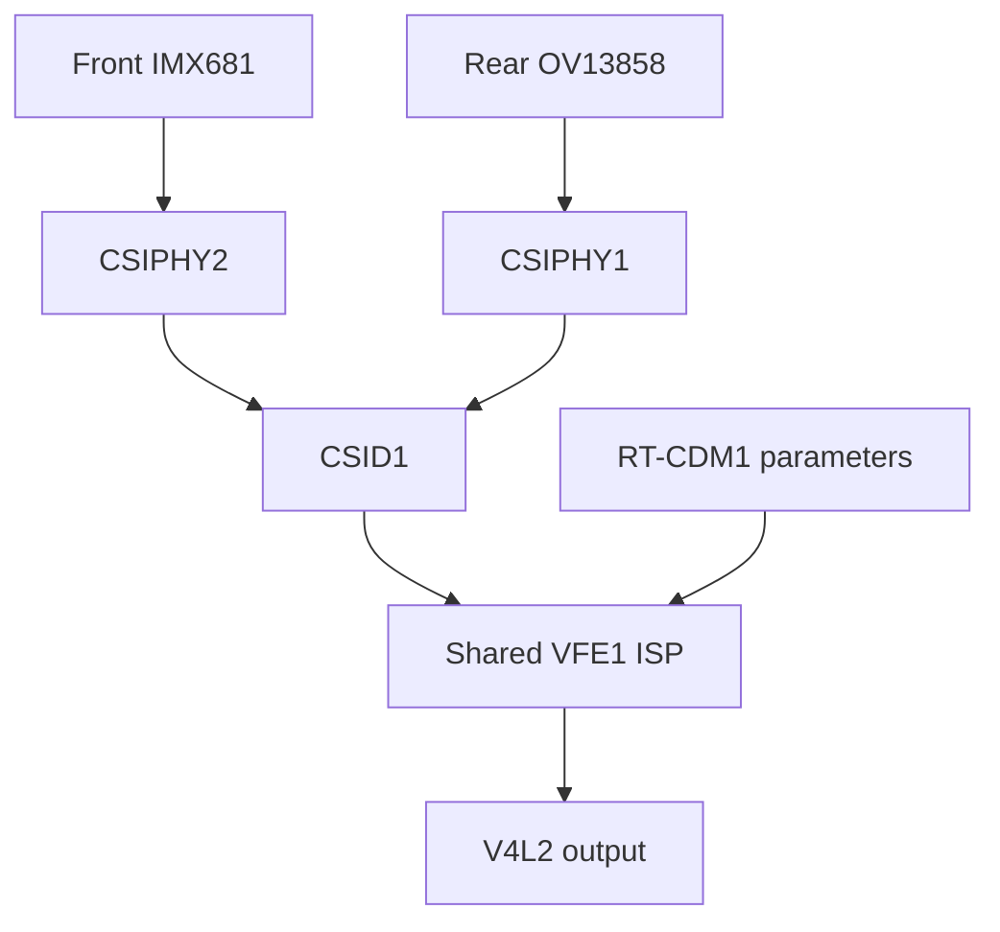

> Source correction: the earlier native build copied a stale ACPI-assuming rear
> snapshot. A real pre-stream test exposed the mistake. The builder now uses the
> SP11 board-powered source. Read NATIVE-RGB-SOURCE-CORRECTION-20261007.md.

> Architecture update: the user accepted hardware ISP + native drivers + standard
> libcamera pipeline/IPA on 2026-10-07. The literal kernel-only boundary discussed
> below is now superseded. Hardware and quality gaps remain unchanged.

# SP11 native RGB engineering audit — 2026-10-07

## Decision and product contract

The current user instruction supersedes the October 6 software-service pivot:
deliver Linux drivers for front IMX681 and rear OV13858, using the real ISP and
standard media-controller/V4L2 interfaces, with correctly labelled processed
frames and Windows-comparable baseline image quality. Custom RGB daemons,
loopback devices, CPU Bayer conversion, AI/effects and Windows binary execution
are not release dependencies. Development tools are distinct from product
runtime. Protected IR/Hello is outside this RGB workstream.

The project has valuable hardware and algorithm evidence, but it has not yet
produced this product. Front native ISP capture is bounded; rear ISP startup is
source-only; ordinary native NV12 and continuous capture remain unproved.

The user subsequently accepted standard libcamera for host-side automatic
exposure, white balance and focus policy. Kernel drivers control hardware and
exchange parameters/statistics. Qualcomm hardware ISP processes pixels. The
architecture boundary is resolved; hardware output and pipeline integration are
still open. Read NATIVE-RGB-LIBCAMERA-20261007.md for the compiled integration.

Primary architecture references:
- https://docs.libcamera.org/master/libcamera_architecture.html
- https://cdn.kernel.org/doc/html/latest/driver-api/media/v4l2-isp.html

## Hardware and work topology

This shows selected RGB routes and shared resources, not simultaneous-stream
support. VFE1 ownership, request generations, command DMA and image/statistics
DMA must be managed as one lifecycle. Current native processed output is QC10C;
the ordinary linear-output path is a candidate.

| Location | Role and present state |
| --- | --- |
| SP11 Linux | Primary ARM64 build and camera target; Golden FullIO v19c, kernel 7.1.5-sp11-render-parity-v4+ |
| SP11 Windows | Same-machine camera quality/behavior oracle; offline during this audit |
| SP7 Windows | External KD, SSH and recovery companion; online, idle during audit |
| PiMaster | Requested control plane, persistent jobs and curated handoff |
| SP11X1ECamera-driver | Current native worktree; work/native-rgb-driver-20261007 |
| SP11X1ECamera-clean | Preserved latest experiment history, df0f26bc; experiment/e004-front-ir-vd55g0 |
| SP11X1ECamera-native | Preserved E012K scalar work, 923e23af; work/e012k-native-rear-compose |
| SP11X1ECamera / SP11X1ECamera-active | Older September 29 workspaces; preserve their evidence, do not resume by accident |
| 02-kernel | Prepared kernel source/headers and isolated candidate builds |
| Private SP11 evidence | Original binaries/tuning, retained traces and optical captures; remain local and uncommitted |

Current native checkout:
`/home/geoca/Documents/SP11-PROJECT/06-camera/SP11X1ECamera-driver`.
It preserves df0f26bc plus the E012K cherry-pick; it does not replace historical
checkouts.

Tools already available include native GCC/Clang/Kbuild, Git/gh, V4L2/media tools,
GStreamer/libcamera, Ghidra, Unicorn/Capstone and external KD. Tool shortages are
not the principal blocker. Use emulation or Windows tracing only to answer a
named missing register/algorithm/behavior question that advances a driver gate.

## Evidence and integration matrix

| Piece | Strongest retained evidence | Remaining engineering work |
| --- | --- | --- |
| RAW sensor transport | E002/E003 and subsequent optical runs; front 3840x2160 RGGB RAW10, rear 4076x2806 GRBG RAW10 | Maintain ordinary source-built sensor and board support |
| Native front VFE1 PIX | E003i-Z/HY and E004JC; bounded real QC10C frames, stats and stop | Replace manually expanded 27-frame runner and host-IQ/bootstrap dependence with repeatable queue-driven streaming |
| Native rear commands | E006G–E008O register/DMI producers and four-packet contract | Compose four complete packet-isolated semantic objects and connect the controlled startup path |
| Neutral scalar producer | E011X; E012K differential result, 26/26 present register instances | E012K uses float/libm: reference code, not kernel-ready arithmetic |
| Rear startup LSC/GTM | E011Y/Z clean replay and binder | Binder now compiled against actual kernel structures; caller still must supply all coherent nonadaptive states |
| Rear DMA lifecycle | E007Z, E008A–N and E011I | Same-generation hardware completion, stop, ownership serialization and release remain physically unproved |
| Ordinary processed format | Existing E004IK–IP NV12 negotiation, layout, WM and mapped-span planners | No measured native linear NV12 frame; explicit UBWC transition still unresolved |
| Software RGB fallback | E004LA/MA; E012E/F/J real front1080/rear4K frames | Does not meet current native-driver product contract |
| Baseline optical IQ | E012J mean Y 57.36 versus Windows 56.99 | Black, colour, shading, tone, detail and automatic controls remain open; mean brightness alone is insufficient |
| Repeated application use | Bounded software switching/reopen | Native repeated STREAMON/OFF, queue reuse, errors, cross-camera ownership and endurance |

## Why work became circular

1. Product direction alternated between full OEM/Hello reproduction, native RGB
   ISP, and a userspace software-camera product.
2. Thousands of narrow emulator/metadata frontiers accumulated without advancing
   a callable processed-camera driver. Those results are dependencies, not
   release milestones.
3. Many source contracts intentionally deny runtime with EOPNOTSUPP. Compilation
   was sometimes described too close to hardware readiness.
4. Handoffs and readiness documents lagged Git and pointed at retired work.
5. Historical builders required old paths, exact old HEADs and consumed output
   directories. Useful later fixes remained disconnected.
6. Completion requirements drifted toward demanding a separate VFE IRQ and
   pre-ACK observation without checking the published VFE680 architecture.
7. No finished ordinary-output and continuous-lifecycle strategy accompanied
   the compressed front-frame proof.

## Corrections from Qualcomm's published source

Inspected public Qualcomm camera-driver revision:
`82ac3a671a5b0a4e3b3ac4519208af1d37a93eb6`.

VFE680 explicitly advertises `CAM_VFE_HW_IRQ_CAP_EXT_CSID`, not a local
BUF_DONE controller. BUS-v3 accepts an externally supplied completion controller.
Its output top half consumes the group mask and reads the Y WM consumed address.
The generic IRQ controller reads and clears status before dispatching the
top-half callbacks. Therefore a separate VFE completion interrupt, an atomic
ten-register snapshot, or a universally pre-ACK sample is not itself a
source-supported prerequisite. E008I is not invalid merely because it samples
after the CSID clear. This corrects older hypotheses; it does not establish
SP11 runtime safety.

The actual requirement is trustworthy CSID-delivered completion correlated with
the correct consumed IOVA, owner epoch and request/buffer generation, with queue
updates serialized and each active image/statistics WM accounted for. Prove
shutdown independently before unmapping/freeing or changing shared ownership.

VFE680 also advertises no reset capability; Qualcomm TOP-v4 explicitly says
reset is unsupported. The native no-op global-reset hook is therefore not
automatically a defect. Do not turn an IRQ global-clear register into an
invented reset operation.

Published BUS-v3 supports FULL NV12 with two WMs, chroma half-height,
PLAIN_8_LSB_MSB_10 packer value 3, aligned stride, line-mode enable and UBWC off.
E004IK–IP already retained this plan. Reuse it. The missing proof is the stopped,
correctly configured compression state and actual SP11 output. Changing packer
or format alone does not clear compression. Never relabel QC10C as NV12.

Relevant public files:
- camera/drivers/cam_isp/isp_hw_mgr/isp_hw/vfe_hw/vfe17x/cam_vfe680.h
- camera/drivers/cam_isp/isp_hw_mgr/isp_hw/vfe_hw/vfe_bus/cam_vfe_bus_ver3.c
- camera/drivers/cam_isp/isp_hw_mgr/isp_hw/vfe_hw/vfe_top/cam_vfe_top_ver4.c
- camera/drivers/cam_isp/isp_hw_mgr/hw_utils/irq_controller/cam_irq_controller.c

BUS-v3 source SHA256:
`dbe53691b46f912d59a5848a7c3e039601088430fd2e3efc992d9100dcc36b44`.

## Work completed in this audit

Added `src/native-rgb/build.py`, a hash-checked, fresh-output kernel-only build.
It stages maintained front CAMSS and IMX681, rebuilds OV13858 from source, reuses
E004IK–IP, and integrates 52 source-origin-pinned rear fragments. It incorporates
E011I's source-only reclaim candidate and compiles E011Z's adaptive binder
against the real E008O types/validator rather than only mocked standalone types.
The retained E008T BF composer referenced nonexistent driver packet/bootstrap
types from its simplified test harness. The integration patch now uses canonical
E008O packet/set types and validates all four request/phase identities before
mutating any BF state. BF ROI adjustment/final parity still remains open.
Rear/NV12 runtime gates remain denied. No daemon is built or installed.

Source composition is deterministic across independent fresh staging directories.
Input digest drift, an out-of-checkout source and reuse of an existing output
are rejected. Three focused composition tests passed. ARM64 Kbuild with W=1
built qcom-camss.ko, imx681.ko and ov13858.ko with zero warnings/errors and the
current Golden vermagic. Module bytes can vary with absolute debug/build paths;
this is source reproducibility, not a claim of byte-identical module builds.

Build evidence:
`/home/geoca/Documents/SP11-PROJECT/02-kernel/native-rgb-20261007-audit-04`.
No installation, camera start or reboot occurred. Golden boot ID remained
`b6fde40d-0a84-4b48-83a1-bec435661a37`; saved default remained
`sp11-audio-fullio-v19c`; next_entry remained empty; RGB service remained inactive.

## Precise rear composition gaps

Do not restart the E008P audit from its old list of unknown origins. Later
experiments already closed several of them:

| State family | Reuse now | Missing executable integration |
| --- | --- | --- |
| Geometry, period and disabled small-IQ | E006P–T, E007W and fixed non-HFR phase policy | Populate each canonical packet from the selected Linux mode |
| RS/BHist/Tintless/AEC/AWB statistics | E009G/H, E010U/Z, E011A–G and E011M–R | Build packet-specific semantic state from established defaults/geometry; producer tracing is not the same as a Linux composer |
| BF/AF bootstrap | E008Q–T, E011S–W; canonical E008T adapter now compiles | Source-implemented ROI validation/adjustment and final DMI consistency; preserve packet0/normal distinction |
| Neutral Demux/PDPC/WB | E011X and E012K, 26/26 differential instances | Kernel-safe arithmetic/input representation and per-phase state binding; float/libm reference cannot run in kernel |
| BPC/ABF registers | E007A packer and retained clean stable DMI | Explicit calculated register-state producer and bounded initial inputs |
| LSC/GTM | E007H/P/Q and E011Y/Z | Kernel-suitable producer/input delivery and full nonadaptive base before sealing |
| Four-packet handoff | E008O materializes independent packet objects | E008K/N old materialize-all path still takes one register/DMI object; consume the four prepared command objects without rematerializing one shared state |
| Ownership and DMA reclaim | E007Z, E008A–N, E011I | Serialized runtime entry plus physical consumed-address/generation and shutdown proof |

The latest RS preset origin is E011M, not the open E011H frontier. AEC/AWB/BF
handoffs also have later source/live closure. Additional Windows tracing is
justified only for a precise remaining input or hardware uncertainty; it is not
required merely to reproduce optional OEM metadata or names. Linux may choose
its own validated policy instead of reproducing every OEM internal abstraction.

## Dependency-ordered delivery gates

| Gate | Concrete acceptance and purpose |
| --- | --- |
| 1. Source composition | Completed kernel-only build, origin manifest and real-structure integration checks; no runtime claim |
| 2. Front ordinary output | Review stopped-state/UBWC transition, then a fresh bounded front2560x1440 linear NV12 candidate; inspect private optical content, geometry and plane layout |
| 3. Rear clean bootstrap | Complete four request/phase-isolated semantic objects; name each missing producer. No optional metadata names, AI/effects or full OEM initialization prerequisite |
| 4. Rear lifetime | Validate CSID completion masks plus consumed-address/generation correlation, serialized owner/queue changes and complete shutdown; no release based on status snapshots alone |
| 5. Rear processed frame | First safely stopped real hardware-processed rear frame; then correctly labelled linear4K output |
| 6. Continuous native streaming | Shared queue-driven VB2 lifecycle, repeated start/stop, starvation, errors and front/rear arbitration; remove unrolled bounded-runner release dependency |
| 7. Baseline IQ | Measured black reference, WB/colour, shading, tone, demosaic/detail and necessary denoise; settle host-policy architecture before automatic exposure/WB/focus |
| 8. Release evidence | Matched optical targets on both OSes, controls, frame rate/latency, sustained capture, switching and crash/stop recovery |

Every new experiment must state which gate it advances and what observation
will close it. A source build, emulator counter, matching register tuple or
matching mean luminance cannot substitute for optical/lifecycle acceptance.

## Persistent constraints

Preserve Golden payloads and permanent default. Use fresh one-shot candidate
identities and record retirement. No Linux suspend/hibernate tests. Private OEM
binaries/tuning and optical pixels remain on SP11. No trust/signature bypass.
No raw captured register replay as production policy. No custom userspace
camera-runtime dependency without resolving the user's explicit requirement.
